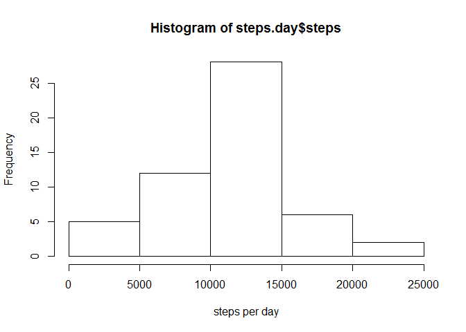
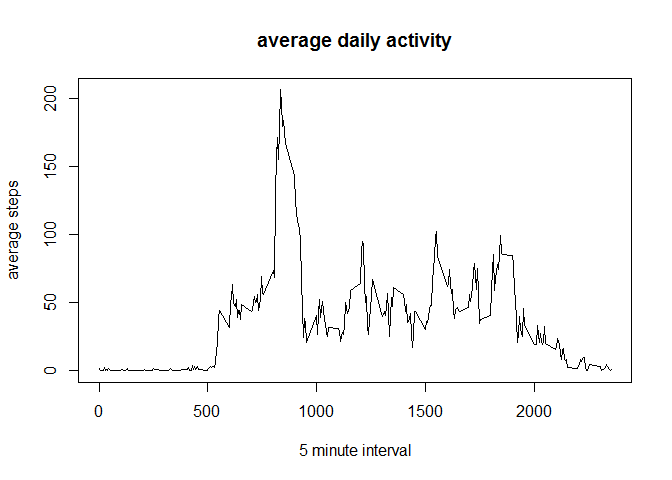
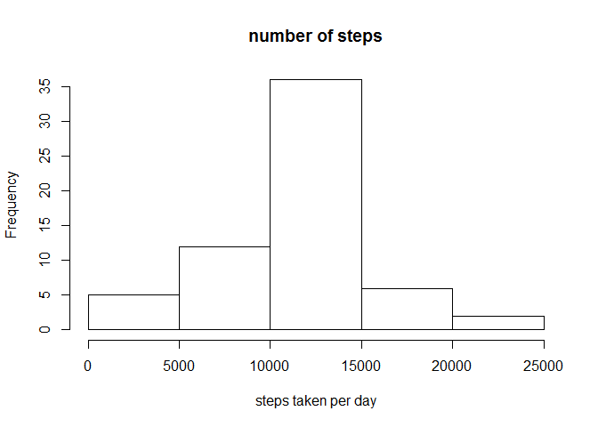

# Reproducable Research PA1

## load the data and then remove NA's

```r
data <- read.csv("activity.csv")
data.noNA <- data[which(data$steps != "NA"), ]
```


## mean total steps per day

```r
library(plyr)
```

```
## Warning: package 'plyr' was built under R version 3.1.1
```

```r
steps.day <- ddply(data.noNA, .(date), summarise, steps=sum(steps))
hist(steps.day$steps, xlab="steps per day")
```

 

```r
# mean and medial steps 

mean (steps.day$steps)
```

```
## [1] 10766
```

```r
median(steps.day$steps)
```

```
## [1] 10765
```

## average daily activity pattern 

```r
average.day <- ddply(data.noNA, .(interval), summarise, steps=mean(steps))
#
plot(average.day$interval, average.day$steps, type="l", xlab="5 minute interval", ylab="average steps",  main="average daily activity")
```

 

```r
# What 5 min interval has max steps
average.day[average.day$steps==max(average.day$steps),]
```

```
##     interval steps
## 104      835 206.2
```

```r
colnames(average.day)[2] <- "intAvg"
```

## inputting missing values

```r
sum(is.na(data$steps))
```

```
## [1] 2304
```

```r
comb <- arrange(join(data, average.day), interval)
```

```
## Joining by: interval
```

```r
comb$steps[is.na(comb$steps)] <- comb$intAvg[is.na(comb$steps)]

#plotting
average.day.comb <- ddply (comb, .(date), summarise, steps=sum(steps))
hist (average.day.comb$steps, main ="number of steps", xlab="steps taken per day")
```

 

```r
#mean and median don't change much
mean(average.day.comb$steps)
```

```
## [1] 10766
```

```r
median(average.day.comb$steps)
```

```
## [1] 10766
```

```r
steps1 <- sum(data.noNA$steps)
steps2 <- sum(comb$steps)
difference <- steps2 - steps1 []
```

mean values didn't change

## differences in activity patterns between weekdays and weekend


```r
library(lattice)
weekdays <- weekdays(as.Date(comb$date))
data_weekdays <- transform(comb, day=weekdays)
data_weekdays$wk <- ifelse(data_weekdays$day %in% c("Saturday", "Sunday"),"weekend", "weekday")
average_week <- ddply(data_weekdays, .(interval, wk), summarise, steps=mean(steps))

xyplot(steps ~ interval | wk, data = average_week, layout = c(1, 2), type="l")
```

 
